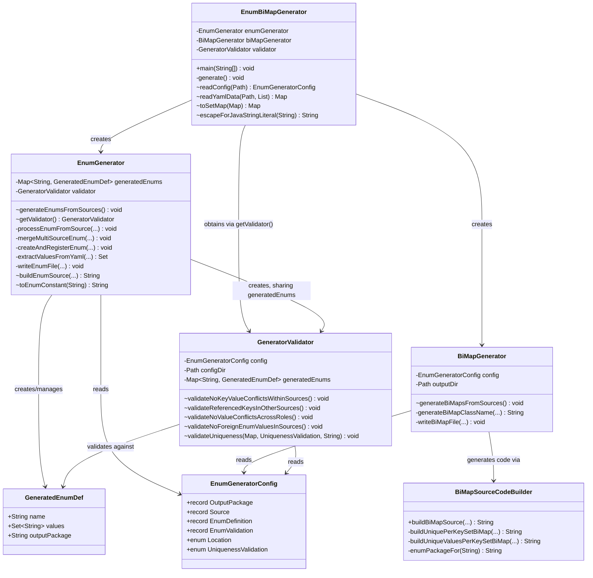

# Reference Data Enum and BiMap Generator

## Overview

presenters-api holds its reference data (form groups, form types, presenter types, statement types and data
objects) as YAML files under `src/main/resources/data/`. At build time a small code generator reads those files and
produces:

- a **Java enum** for each kind of reference value (e.g. `FormGroup`, `PresenterType`)
- a **BiMap** class for each YAML file, giving type-safe lookups in both directions between a key enum and a value
  enum (e.g. `FormGroup` ↔ `FormType`)

At runtime each generated BiMap is a Spring `@ConfigurationProperties` bean, populated from the same YAML files.

The generator lives in `uk.gov.companieshouse.presentersapi.data.reference` and is driven by
`src/main/resources/enum-generator-config.yaml`. Generated code is written to
`target/generated-sources/java` and is never committed.

## Build Integration

The generator runs during the `generate-sources` phase, before the application itself is compiled. It is wired up in
`pom.xml` by three plugin executions:

1. **`maven-compiler-plugin` (`compile-generator`)** compiles only the generator classes
   (`uk/gov/companieshouse/presentersapi/data/reference/*.java`).
2. **`exec-maven-plugin` (`generate-enum-bimaps`)** runs `EnumBiMapGenerator.main` with two arguments:
   - `src/main/resources/enum-generator-config.yaml`
   - `target/generated-sources/java`
3. **`build-helper-maven-plugin` (`add-generated-sources`)** registers `target/generated-sources/java` as a source
   root, so the normal `default-compile` execution compiles the generated enums and BiMaps alongside the application.

The compiler is also configured with `<parameters>true</parameters>`, which the generated BiMaps' constructor binding
relies on (see [Spring Boot Integration](#spring-boot-integration)).

Any validation failure in the generator throws an exception, failing the build with a message that identifies the
offending YAML file and value.

## Architecture Diagram



`EnumGenerator` builds enum source itself (`buildEnumSource`); `BiMapSourceCodeBuilder` is used only for BiMaps.

## Class Responsibilities

### EnumBiMapGenerator (Orchestrator)

**Role:** Entry point for the build; runs the 6-phase generation and validation pipeline.

- Parses command-line arguments (`<configFile> <outputDir>`); YAML source paths in the config are resolved relative
  to the config file's directory
- Loads `enum-generator-config.yaml` into an `EnumGeneratorConfig`
- Creates `EnumGenerator` and `BiMapGenerator`, and obtains the shared `GeneratorValidator` from
  `EnumGenerator.getValidator()`
- Runs the phases in order (see [Generation Pipeline](#generation-pipeline-6-phases))

**Shared utilities (package-private static):**

- `readConfig(Path)`: parses the generator configuration
- `readYamlData(Path, List<String>)`: loads a data file, navigates the `root-keys` path, and returns each key's values
  as a list (duplicates preserved, so uniqueness validation can detect them). A value must be a list of strings or
  empty; a single scalar is rejected as a probable typo.
- `toSetMap(Map)`: converts the lists to insertion-ordered sets (drops duplicates within a key)
- `escapeForJavaStringLiteral(String)`: escapes backslashes and quotes for generated string literals

---

### EnumGenerator (Enum Extraction and Generation)

**Role:** Extracts enum values from the YAML sources and writes the Java enum classes (Phase 1).

- Reads each source's dictionary at its configured `root-keys`
- Extracts values by `Location`: `DICTIONARY_KEYS` or `DICTIONARY_VALUES`
- Runs uniqueness validation for each enum definition that declares one (per source)
- Merges enums defined in more than one source (e.g. `DeliveryStatementType` comes from both
  `delivery-statement-by-form-group.yaml` and `delivery-statement-by-presenter-type.yaml`), rewriting the enum file
  with the combined values
- Generates enum source with:
  - constant names normalised by `toEnumConstant` (upper case, runs of non-alphanumerics replaced by `_`, leading
    `_` added if the name would start with a digit), e.g. `firm-delivery` → `FIRM_DELIVERY`
  - the original YAML value kept as the enum's `code()`, annotated with Jackson `@JsonValue`
  - a static `from(String)` factory annotated with `@JsonCreator`, backed by an unmodifiable `BY_CODE` map; it
    throws `IllegalArgumentException` for an unknown code
- Fails generation if an enum ends up with no values, or if two values normalise to the same constant name
- Creates the `GeneratorValidator`, passing it the `generatedEnums` map so later validation phases can see every
  extracted value

---

### BiMapGenerator (BiMap Generation)

**Role:** Writes one BiMap class per source that declares both `key-enum` and `value-enum` (Phase 6).

- Names each class `<KeyEnum><ValueEnum>BiMap`, e.g. `FormGroupFormTypeBiMap`
- Takes the uniqueness mode from the source's `DICTIONARY_VALUES` enum definition in `EnumGeneratorConfig`
  (it does not use `GeneratedEnumDef`)
- Derives the `@ConfigurationProperties` prefix from the **first** root key and the constructor parameter name from
  the **second** root key
- Delegates source generation to `BiMapSourceCodeBuilder` and writes the file to the configured `bimaps` package

---

### GeneratorValidator (Data Validation)

**Role:** Checks the data across all YAML sources (Phases 2–5) and enforces uniqueness rules (during Phase 1).

| Phase | Method | Checks |
|-------|--------|--------|
| 2 | `validateNoKeyValueConflictsWithinSources()` | No value appears as both a key and a value in the same file |
| 3 | `validateReferencedKeysInOtherSources()` | For enums with `validate-as-keys-in-other-sources: true`, every other source that declares it as its `dictionary-keys-reference` uses only valid values of that enum as keys (logged as `[Auto-discovery]`) |
| 4 | `validateNoValueConflictsAcrossRoles()` | No value is used as a key for one enum in one file and as a value for a different enum in another |
| 5 | `validateNoForeignEnumValuesInSources()` | Every key and value in a source belongs to the enum declared for that role (no values from other enums) |

`validateUniqueness(Map<String, List<String>>, UniquenessValidation, String)` is the static check that enforces
the uniqueness modes (see [Uniqueness Modes](#uniqueness-modes-uniquenessvalidation)); `EnumGenerator` calls it in
Phase 1.

Error messages name the source file and offending value, with a hint on how to fix it.

**Exception handling:** Java stream lambdas cannot throw checked exceptions, so `IOException`s raised inside
`forEach`/`map` are wrapped in the nested `GeneratorValidator.WrappedIOException` (unchecked) and unwrapped and
rethrown outside the stream. `EnumGenerator` and `BiMapGenerator` use the same pattern.

---

### BiMapSourceCodeBuilder (BiMap Source Generation)

**Role:** Builds the complete Java source for a BiMap class.

- `buildBiMapSource(...)` chooses the template from the uniqueness mode:
  - **`VALUES_PER_KEY_SET`** → `buildUniquePerKeySetBiMap`: singular reverse map `EnumMap<ValueEnum, KeyEnum>`;
    construction uses `putIfAbsent()` and throws `IllegalStateException` if a value is under two keys
  - **`VALUES_PER_KEY`** (also the default when no mode is set) → `buildUniqueValuesPerKeySetBiMap`: plural reverse
    map `EnumMap<ValueEnum, EnumSet<KeyEnum>>`, populated with `computeIfAbsent()`
- The forward map is always `EnumMap<KeyEnum, EnumSet<ValueEnum>>`, as each YAML key maps to a list
- Converts the kebab-case YAML property name to the camelCase constructor parameter (`by-form-group` →
  `byFormGroup`) using commons-text `CaseUtils`
- Derives the enum package from the BiMap package (`.bimaps` → `.enums`) via `enumPackageFor`
- Makes each BiMap implement `uk.gov.companieshouse.presentersapi.data.ReferenceBiMap`
- Makes getters return a **copy** of the stored `EnumSet`, so callers cannot change the shared reference data

---

### EnumGeneratorConfig (Configuration Records)

**Role:** Jackson-bound model of `enum-generator-config.yaml`.

- `OutputPackage` record: `enums`, `bimaps` target packages
- `Source` record: `root-keys`, `key-enum`, `value-enum`, and an `enums` map of enum name → `EnumDefinition`
- `EnumDefinition` record: `location`, `dictionary-keys-reference`, `validation`
- `EnumValidation` record: `uniqueness` (`UniquenessValidation`), `validate-as-keys-in-other-sources`
- `Location` enum: `DICTIONARY_KEYS`, `DICTIONARY_VALUES`
- `UniquenessValidation` enum: `VALUES_PER_KEY_SET`, `VALUES_PER_KEY`

---

### GeneratedEnumDef (Generated Enum Metadata)

```java
public record GeneratedEnumDef(
    String name,          // enum class name
    Set<String> values,   // extracted values (codes), merged across sources
    String outputPackage  // target package
) {}
```

## Generation Pipeline (6 Phases)

Run in this order by `EnumBiMapGenerator.generate()`:

```
Phase 1: EnumGenerator.generateEnumsFromSources()
         └─ Extract enum values, apply uniqueness validation, merge multi-source enums, write enum files

Phase 2: GeneratorValidator.validateNoKeyValueConflictsWithinSources()
         └─ Keys and values don't overlap within a file

Phase 3: GeneratorValidator.validateReferencedKeysInOtherSources()
         └─ Enums used as keys in other sources only use valid values

Phase 4: GeneratorValidator.validateNoValueConflictsAcrossRoles()
         └─ No value is a key of one enum and a value of another across sources

Phase 5: GeneratorValidator.validateNoForeignEnumValuesInSources()
         └─ Every value belongs to its declared enum

Phase 6: BiMapGenerator.generateBiMapsFromSources()
         └─ Write a BiMap class for each key-enum/value-enum pair
```

Enum files are written in Phase 1, before validation. If a later phase fails, the build fails, so partially
validated output is never compiled.

## Uniqueness Modes (UniquenessValidation)

The mode is set on a source's value enum. It controls both the validation rule and the shape of the BiMap's reverse
mapping. Generated method names follow the enum names: for key enum `K` and value enum `V`, the forward getter is
`<v>sFor(K key)`.

### VALUES_PER_KEY_SET

**Rule:** each value appears under **at most one** key in the source.

- Forward: `EnumMap<KeyEnum, EnumSet<ValueEnum>>`
- Reverse: `EnumMap<ValueEnum, KeyEnum>` (singular)
- Reverse getter: `public K <k>For(final V value)`, e.g. `FormGroup formGroupFor(FormType value)`; returns `null`
  for an unmapped value

**Example:** `form-type-by-form-group.yaml`. Each form type belongs to exactly one form group, so `AD01` appearing
under both `firm-delivery` and `individual-delivery` fails the build.

### VALUES_PER_KEY

**Rule:** a value may appear under **many** keys, but not twice under the same key.

- Forward: `EnumMap<KeyEnum, EnumSet<ValueEnum>>`
- Reverse: `EnumMap<ValueEnum, EnumSet<KeyEnum>>` (plural)
- Reverse getter: `public EnumSet<K> <k>sFor(final V value)`, e.g.
  `EnumSet<FormGroup> formGroupsFor(PresenterType value)`; returns an empty set for an unmapped value

**Example:** `presenter-type-by-form-group.yaml`. `officer-employee` is allowed under both `firm-delivery` and
`individual-delivery`, but listing it twice under `firm-delivery` fails the build.

## Current Sources and Generated Classes

| Data file | Root keys (prefix, property) | Key enum | Value enum | Mode | BiMap |
|-----------|------------------------------|----------|------------|------|-------|
| `form-type-by-form-group.yaml` | `form-types-map`, `by-form-group` | `FormGroup` | `FormType` | `VALUES_PER_KEY_SET` | `FormGroupFormTypeBiMap` |
| `presenter-type-by-form-group.yaml` | `presenter-types-map`, `by-form-group` | `FormGroup` | `PresenterType` | `VALUES_PER_KEY` | `FormGroupPresenterTypeBiMap` |
| `delivery-statement-by-form-group.yaml` | `delivery-statements-map`, `by-form-group` | `FormGroup` | `DeliveryStatementType` | `VALUES_PER_KEY` | `FormGroupDeliveryStatementTypeBiMap` |
| `delivery-statement-by-presenter-type.yaml` | `delivery-statements-map`, `by-presenter-type` | `PresenterType` | `DeliveryStatementType` | `VALUES_PER_KEY` | `PresenterTypeDeliveryStatementTypeBiMap` |
| `verification-statement-by-presenter-type.yaml` | `verification-statements-map`, `by-presenter-type` | `PresenterType` | `VerificationStatementType` | `VALUES_PER_KEY` | `PresenterTypeVerificationStatementTypeBiMap` |
| `association-statement-by-presenter-type.yaml` | `association-statements-map`, `by-presenter-type` | `PresenterType` | `AssociationStatementType` | `VALUES_PER_KEY` | `PresenterTypeAssociationStatementTypeBiMap` |
| `data-object-by-presenter-type.yaml` | `data-objects-map`, `by-presenter-type` | `PresenterType` | `DataObjectType` | `VALUES_PER_KEY` | `PresenterTypeDataObjectTypeBiMap` |

Where enum values come from:

- `FormGroup`: keys of `form-type-by-form-group.yaml`
- `PresenterType`: values of `presenter-type-by-form-group.yaml`
- Other sources keyed by these enums declare them as their `dictionary-keys-reference`, so Phase 3 checks those keys

Both `FormGroup` and `PresenterType` have `validate-as-keys-in-other-sources: true`.

The two `delivery-statements-map` sources share a prefix but bind different properties (`by-form-group`,
`by-presenter-type`).

## Spring Boot Integration

### Loading the Data

`src/main/resources/application.properties` imports every data file into the Spring `Environment`:

```properties
spring.config.import[0]=classpath:data/form-type-by-form-group.yaml
spring.config.import[1]=classpath:data/presenter-type-by-form-group.yaml
...
spring.config.import[6]=classpath:data/data-object-by-presenter-type.yaml
```

Every source listed in `enum-generator-config.yaml` must be imported here. The imports are deliberately not
`optional:`, so a missing or misnamed file fails startup. However, **forgetting to add an import is not an error**:
the BiMap bean is simply created empty and lookups return nothing. `ReferenceBiMapSummaryLogger` (below) makes this
visible.

### Bean Discovery

`PresentersApiApplication` is annotated with `@ConfigurationPropertiesScan` (no arguments). It scans
`uk.gov.companieshouse.presentersapi` and all sub-packages, including the generated
`uk.gov.companieshouse.presentersapi.data.bimaps`, and registers each `@ConfigurationProperties` BiMap as a bean.

### Binding

Taking `form-type-by-form-group.yaml` as an example:

```yaml
form-types-map:
  by-form-group:
    firm-delivery:
      - AD01
      - CS01
    individual-delivery:
      - PSC01
    official-receiver:
    # ...
```

The generated class uses **constructor binding**:

```java
@ConfigurationProperties(prefix = "form-types-map")
public class FormGroupFormTypeBiMap implements ReferenceBiMap {
    private final EnumMap<FormGroup, EnumSet<FormType>> byFormGroup;
    private final EnumMap<FormType, FormGroup> byFormType;

    public FormGroupFormTypeBiMap(final Map<FormGroup, Set<FormType>> byFormGroup) {
        // builds the forward and reverse EnumMaps, validating uniqueness
    }

    public EnumSet<FormType> formTypesFor(final FormGroup key) { ... }
    public FormGroup formGroupFor(final FormType value) { ... }
    public int forwardEntryCount() { ... }
    public int reverseEntryCount() { ... }
}
```

Notes:

- The prefix is the first root key (`form-types-map`), and `by-form-group` binds to the `byFormGroup` constructor
  parameter. This requires the class to be compiled with `-parameters` (set in `pom.xml`).
- Spring Boot binds enums leniently, ignoring case and non-alphanumeric characters, so YAML codes such as
  `firm-delivery` bind to `FormGroup.FIRM_DELIVERY` and `officer-employee` to `PresenterType.OFFICER_EMPLOYEE`.
  `toEnumConstant` produces names that are always compatible with this.
- An empty key (e.g. `official-receiver:`) binds to an empty set.

### Startup Reporting

- `ReferenceBiMap` (`uk.gov.companieshouse.presentersapi.data`) is implemented by every generated BiMap and exposes
  `forwardEntryCount()` and `reverseEntryCount()`.
- `ReferenceBiMapSummaryLogger` receives every `ReferenceBiMap` bean and, on `ApplicationReadyEvent`, logs one line
  per BiMap, for example:

  ```
  BiMap 'FormGroupFormTypeBiMap' created: 8 forward mappings (keys), 8 reverse mappings (values)
  ```

  A BiMap with no forward entries is logged at **error** level with a hint to check `spring.config.import`.

### Using the BiMaps

Inject a BiMap bean wherever reference lookups are needed:

```java
@Service
public class ExampleService {
    private final FormGroupFormTypeBiMap formGroupFormType;

    public ExampleService(final FormGroupFormTypeBiMap formGroupFormType) {
        this.formGroupFormType = formGroupFormType;
    }

    public EnumSet<FormType> formTypesFor(final String formGroupCode) {
        return formGroupFormType.formTypesFor(FormGroup.from(formGroupCode));
    }
}
```

No REST endpoints currently expose the BiMaps. The generated enums serialise to and from their YAML codes via
`@JsonValue`/`@JsonCreator`, so they can be used directly in request and response models.

### Runtime Characteristics

- Mappings are built once at startup; lookups are constant-time `EnumMap` reads.
- The internal maps are never exposed. Set-returning getters return a copy, so callers cannot change the shared
  data, and the beans are safe to share across threads.

## Output Structure

```
target/generated-sources/java/
└── uk/gov/companieshouse/presentersapi/data/
    ├── enums/
    │   ├── AssociationStatementType.java
    │   ├── DataObjectType.java
    │   ├── DeliveryStatementType.java
    │   ├── FormGroup.java
    │   ├── FormType.java
    │   ├── PresenterType.java
    │   └── VerificationStatementType.java
    └── bimaps/
        ├── FormGroupDeliveryStatementTypeBiMap.java
        ├── FormGroupFormTypeBiMap.java
        │   └── @ConfigurationProperties(prefix = "form-types-map")
        │   └── Forward: FormGroup → EnumSet<FormType>
        │   └── Reverse: FormType → FormGroup (VALUES_PER_KEY_SET)
        ├── FormGroupPresenterTypeBiMap.java
        │   └── @ConfigurationProperties(prefix = "presenter-types-map")
        │   └── Forward: FormGroup → EnumSet<PresenterType>
        │   └── Reverse: PresenterType → EnumSet<FormGroup> (VALUES_PER_KEY)
        ├── PresenterTypeAssociationStatementTypeBiMap.java
        ├── PresenterTypeDataObjectTypeBiMap.java
        ├── PresenterTypeDeliveryStatementTypeBiMap.java
        └── PresenterTypeVerificationStatementTypeBiMap.java
```

## Adding a New Reference Data File

1. Add the YAML file under `src/main/resources/data/`, with a two-level root (`<prefix>:` then `<property>:`) above
   the dictionary.
2. Add a `sources` entry to `enum-generator-config.yaml` with `root-keys`, `key-enum`, `value-enum` and the enum
   definitions. Use `dictionary-keys-reference` if the keys belong to an enum defined in another source.
3. Add the next `spring.config.import[n]=classpath:data/<file>.yaml` line to `application.properties`.
4. Build. Generator validation failures fail the build with a description of the problem.
5. Extend `BiMapBeansIT` to cover the new BiMap. It checks that `ReferenceBiMapSummaryLogger` reports the expected
   number of BiMaps.

## Testing

- **Unit tests** (`src/test/java/.../data/reference/`, run by Surefire) cover the generator classes: enum
  normalisation and generation, BiMap source generation, YAML reading, and each validation phase.
- **Integration test** `BiMapBeansIT` (`src/integration-test/java`, run by Failsafe in `verify`) starts the Spring
  context against the real data files. It checks that every BiMap is bound and populated in both directions, that
  returned sets are defensive copies, and that the summary logger reports all of them.

## Dependencies

| Used by | Dependency | Purpose |
|---------|------------|---------|
| Generator | `tools.jackson.dataformat:jackson-dataformat-yaml` | Reading the generator config and data YAML |
| Generator | `com.fasterxml.jackson.core:jackson-annotations` | `@JsonProperty` on config records |
| Generator | `org.apache.commons:commons-lang3` | `StringUtils` |
| Generator | `org.apache.commons:commons-text` | `CaseUtils` (kebab-case → camelCase) |
| Generator | `uk.gov.companieshouse:structured-logging` | Generator progress and auto-discovery logging |
| Generated enums | `com.fasterxml.jackson.core:jackson-annotations` | `@JsonValue`, `@JsonCreator` |
| Generated BiMaps | Spring Boot | `@ConfigurationProperties` binding |
