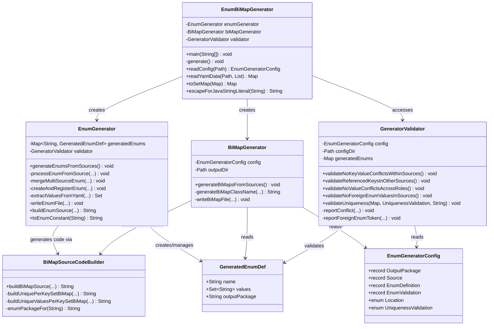

# YAML BiDirectional Mapping Generator - Class Structure

## Overview

The generator follows the **Single Responsibility Principle**, separating concerns into multiple classes that coordinate to generate Java enums and bidirectional maps from YAML configuration. The pipeline orchestrates enum extraction, validation, and BiMap generation in a coordinated 6-phase process.

## Architecture Diagram



## Class Responsibilities

### **EnumBiMapGenerator** (Orchestrator)
**Role:** Coordinates the 6-phase code generation and validation pipeline  
**Key Responsibilities:**
- Parses command-line arguments (config file path, output directory)
- Loads YAML configuration from the specified config file
- Instantiates EnumGenerator, BiMapGenerator, and GeneratorValidator
- Orchestrates sequential execution of all 6 phases
- Provides shared utilities for YAML reading and Java string escaping
- Maintains consistency across all generation phases

**Shared Utilities:**
- `readConfig(Path)`: Parses YAML configuration
- `readYamlData(Path, List<String>)`: Loads YAML data with root-keys navigation, preserves duplicates
- `toSetMap(Map)`: Converts list-based YAML data to set-based (deduplicates)
- `escapeForJavaStringLiteral(String)`: Escapes backslashes and quotes for Java strings

**Input:** Command-line args (config file path, output directory)  
**Output:** Generated Java enum and BiMap files

---

### **EnumGenerator** (Enum Extraction & Generation)
**Role:** Extracts enums from YAML dictionaries and generates Java enum classes  
**Key Responsibilities:**
- Reads YAML source files according to configured root-keys and enum definitions
- Extracts enum values by location (DICTIONARY_KEYS or DICTIONARY_VALUES)
- Handles multi-source enums (same enum defined in multiple YAML files)
- Merges enum definitions while detecting normalization collisions
- Generates Java enum source code with:
  - SCREAMING_SNAKE_CASE constant naming
  - Jackson `@JsonValue` and `@JsonCreator` annotations
  - Efficient code lookup via `BY_CODE` unmodifiable map
- Writes enum files to the configured enums package
- Validates uniqueness within each source (per EnumDefinition validation config)

**Key Methods:**
```
generateEnumsFromSources()              # Phase 1: Main entry point
processEnumFromSource(...)              # Extract and register enum from source
mergeMultiSourceEnum(...)               # Merge enum from additional source
createAndRegisterEnum(...)              # Create new enum and register
extractValuesFromYaml(...)              # Extract values based on Location
writeEnumFile(...)                      # Write Java source to disk
buildEnumSource(...) [static]           # Generate Java enum source code
toEnumConstant(String) [static]         # Convert value to SCREAMING_SNAKE_CASE
```

**Collaborators:**
- `EnumGeneratorConfig`: Reads extraction rules and validation config
- `GeneratedEnumDef`: Records generated enum metadata (name, values, package)
- `GeneratorValidator`: Accesses validator for uniqueness validation

---

### **BiMapGenerator** (BiMap Generation)
**Role:** Generates bidirectional map classes for enum pairs  
**Key Responsibilities:**
- Identifies enum pairs (key-enum and value-enum) from each YAML source
- Determines uniqueness validation mode for reverse mapping:
  - `VALUES_PER_KEY_SET`: Each value appears under at most one key (reverse: singular)
  - `VALUES_PER_KEY`: Each value can appear under multiple keys (reverse: plural)
- Generates BiMap class names following `<KeyEnum><ValueEnum>BiMap` pattern
- Delegates source code generation to `BiMapSourceCodeBuilder` based on validation mode
- Writes BiMap files to the configured bimaps package
- BiMaps are annotated with `@ConfigurationProperties` for Spring binding

**Key Methods:**
```
generateBiMapsFromSources()             # Phase 6: Main entry point
generateBiMapClassName(...)             # Compute BiMap class name
writeBiMapFile(...)                     # Write Java source to disk
```

**Collaborators:**
- `BiMapSourceCodeBuilder`: Generates source code strings based on validation mode
- `EnumGeneratorConfig`: Reads enum configuration and uniqueness validation rules
- `GeneratedEnumDef`: Accesses enum names (validation mode derived from value-enum definition)

---

### **GeneratorValidator** (Data Validation)
**Role:** Validates data consistency across all YAML sources and enforces constraints  
**Key Responsibilities:**
- **Within-source validation:** Ensures dictionary keys and values don't overlap in the same file
- **Cross-source reference validation:** Checks that enums marked with `validate-as-keys-in-other-sources` are actually used as keys elsewhere
- **Role consistency:** Prevents enum values appearing with conflicting roles across sources
- **Foreign enum detection:** Ensures all values belong to their declared enum (no cross-contamination)
- **Uniqueness validation:** Enforces cardinality based on UniquenessValidation mode:
  - `VALUES_PER_KEY_SET`: Each value unique across entire source (at most one key per value)
  - `VALUES_PER_KEY`: Values unique only within each key (same value allowed under different keys)
- **Comprehensive error reporting** with context and remediation hints

**Validation Phases (4 total, executed in EnumBiMapGenerator.generate()):**
1. `validateNoKeyValueConflictsWithinSources()` - Ensure keys ≠ values in same file
2. `validateReferencedKeysInOtherSources()` - Cross-source reference and auto-discovery
3. `validateNoValueConflictsAcrossRoles()` - Role consistency check across sources
4. `validateNoForeignEnumValuesInSources()` - Foreign enum token detection

**Static Utility:**
- `validateUniqueness(Map<String, List<String>>, UniquenessValidation, String)`: Core uniqueness enforcement

**Key Methods:**
```
validateNoKeyValueConflictsWithinSources()   # Phase 2 validation
validateReferencedKeysInOtherSources()       # Phase 3 validation
validateNoValueConflictsAcrossRoles()        # Phase 4 validation
validateNoForeignEnumValuesInSources()       # Phase 5 validation
validateUniqueness(...) [static]             # Core uniqueness check
```

**Exception Handling:**
Uses `WrappedIOException` to work around Java streams' checked exception limitation: checked `IOException`s are wrapped in this unchecked exception inside stream operations, then unwrapped and rethrown.

---

### **BiMapSourceCodeBuilder** (Code Generation Utility)
**Role:** Generates complete Java source code for BiMap classes  
**Key Responsibilities:**
- Generates complete BiMap class source code based on uniqueness validation mode
- Adapts generated code structure:
  - **VALUES_PER_KEY_SET**: Singular reverse field `EnumMap<ValueEnum, KeyEnum>` + `keyFor(value)` method
    - Uses `putIfAbsent()` with duplicate detection; throws if value appears under multiple keys
  - **VALUES_PER_KEY**: Plural reverse field `EnumMap<ValueEnum, EnumSet<KeyEnum>>` + `keysFor(value)` method
    - Uses `computeIfAbsent()` to populate reverse mappings; allows same value under multiple keys
- Converts YAML property names from kebab-case to camelCase
- Converts BiMap package name (`.bimaps?` → `.enums`) for enum imports
- Generates Spring `@ConfigurationProperties` annotations with correct prefix
- Generates forward mapping as always ONE-TO-MANY (EnumMap + EnumSet) per YAML structure

**Key Methods:**
```
buildBiMapSource(...) [static]              # Main entry point, routes based on validation mode
buildUniquePerKeySetBiMap(...) [static]     # Generate VALUES_PER_KEY_SET variant
buildUniqueValuesPerKeySetBiMap(...) [static] # Generate VALUES_PER_KEY variant
enumPackageFor(String) [static]             # Convert BiMap package to enum package
```

---

### **EnumGeneratorConfig** (Configuration Data Classes)
**Role:** Holds configuration structure for YAML parsing  
**Contents:**
- `Location` enum: `DICTIONARY_KEYS`, `DICTIONARY_VALUES` - Where to extract enum values
- `UniquenessValidation` enum:
  - `VALUES_PER_KEY_SET`: Each value unique across entire source (at most one key per value)
  - `VALUES_PER_KEY`: Values unique only within each key (multiple keys allowed per value)
- `OutputPackage` record: `enumPackage`, `bimapPackage` - Target packages for generated code
- `Source` record: Source file configuration with `rootKeys`, `keyEnum`, `valueEnum`, and `enums` map
- `EnumDefinition` record: Per-enum config with `location`, `dictionaryKeysReference`, `validation`
- `EnumValidation` record: Validation rules with `uniquenessValidation` and `validateAsKeysInOtherSources`

---

### **GeneratedEnumDef** (Data Transfer Object)
**Role:** Records generated enum metadata  
**Contents:**
```java
record GeneratedEnumDef(
    String name,              // Enum class name
    Set<String> values,       // Extracted enum constant values
    String outputPackage      // Target package for generated class
)
```

---

## Generation Pipeline (6 Phases)

```
Phase 1: generateEnumsFromSources()
         └─ Extract enums from YAML sources, generate Java enum files
         └─ Execute per EnumDefinition validation (uniqueness within source)

Phase 2: validateNoKeyValueConflictsWithinSources()
         └─ Ensure keys and values don't overlap in same file

Phase 3: validateReferencedKeysInOtherSources()
         └─ Cross-source reference validation and auto-discovery

Phase 4: validateNoValueConflictsAcrossRoles()
         └─ Ensure enums don't have conflicting roles across sources

Phase 5: validateNoForeignEnumValuesInSources()
         └─ Ensure all values belong to their declared enum

Phase 6: generateBiMapsFromSources()
         └─ Generate BiMap classes for enum pair mappings
```

## Cardinality Semantics (UniquenessValidation)

The `UniquenessValidation` enum controls how BiMap reverse mappings are structured and enforced:

### **VALUES_PER_KEY_SET**
**Semantics:** Each dictionary value appears under **at most one** dictionary key across the entire source.

**BiMap Structure:**
- Forward: `EnumMap<KeyEnum, EnumSet<ValueEnum>>`
- Reverse: `EnumMap<ValueEnum, KeyEnum>` (singular, not a set)

**Method Signature:**
```java
public KeyEnum keyFor(final ValueEnum value)
```

**Validation:** Uses `putIfAbsent()` during construction. If any value is found under multiple keys, an `IllegalStateException` is thrown immediately.

**Use Case Example:** FormType in form-type-by-form-group.yaml
- Each form type belongs to exactly one form group
- Violation: FormType "standard-form" appearing under both "firm" and "individual" groups

---

### **VALUES_PER_KEY**
**Semantics:** Each dictionary value can appear under **multiple** dictionary keys, but must be unique **within** each key's value set (no duplicates per key).

**BiMap Structure:**
- Forward: `EnumMap<KeyEnum, EnumSet<ValueEnum>>`
- Reverse: `EnumMap<ValueEnum, EnumSet<KeyEnum>>` (plural, a set)

**Method Signature:**
```java
public EnumSet<KeyEnum> keysFor(final ValueEnum value)
```

**Validation:** Uses `computeIfAbsent()` to accumulate multiple keys per value. YAML structure and configuration validation ensure no duplicate values within the same key.

**Use Case Example:** PresenterType in presenter-type-by-form-group.yaml
- Same presenter type can serve multiple form groups
- Example: "officer-employee" works for both "firm-delivery" AND "individual-delivery"
- Allowed: PresenterType "officer-employee" under multiple groups
- Not allowed: Same PresenterType twice under the same group (prevented by YAML structure)

---

## Key Design Patterns

### **Single Responsibility Principle**
- Each class has one reason to change
- Clear separation: extraction, validation, code generation

### **Strategy Pattern**
- `BiMapSourceCodeBuilder.buildBiMapSource()` routes to implementation based on `UniquenessValidation`
- VALUES_PER_KEY_SET and VALUES_PER_KEY generate fundamentally different class structures

### **Builder Pattern**
- `BiMapSourceCodeBuilder` constructs complex source code strings using template methods

### **Data Transfer Objects**
- `GeneratedEnumDef`, `EnumGeneratorConfig`, `EnumValidation`, etc. hold data without behavior
- Decouples configuration from processing logic

### **Exception Wrapping Pattern**
- `WrappedIOException` bridges checked `IOException` and unchecked exceptions in stream operations
- Enables proper exception propagation through forEach lambdas

## Configuration Flow

```
enum-generator-config.yaml
        ↓
EnumGeneratorConfig (parsed)
        ↓
    ↙              ↓              ↘
EnumGenerator  GeneratorValidator  BiMapGenerator
    ↓              ↓                  ↓
Generated      Validation Reports  BiMaps
Enums          (4 phases)           (Phase 6)
```

## Spring Boot Integration via @ConfigurationProperties

The generated BiMap classes integrate seamlessly with Spring Boot through the `@ConfigurationProperties` annotation, enabling declarative configuration binding from YAML files.

### **BiMap Generation with @ConfigurationProperties**

Each generated BiMap class is annotated with:
```java
@ConfigurationProperties(prefix = "data.<source-name>")
public class FormGroupFormTypeBiMap { ... }
```

The prefix is derived from the YAML source configuration:
- Source file: `form-type-by-form-group.yaml`
- Generated prefix: `data.form-type-by-form-group`
- Property access: Kebab-case properties (from YAML dictionary keys) are converted to camelCase setters

### **Configuration Binding Flow**

```
src/main/resources/data/form-type-by-form-group.yaml
    ↓
Spring reads and parses YAML structure
    ↓
@ConfigurationProperties(prefix = "data.form-type-by-form-group")
    ↓
Spring binds YAML keys → BiMap constructor/setters
    ↓
BiMap bean registered in ApplicationContext
    ↓
REST controller @Autowires BiMap bean
    ↓
Query methods: formTypesFor(formGroup), formGroupFor(formType)
```

### **YAML Structure to BiMap Mapping**

```yaml
# src/main/resources/data/form-type-by-form-group.yaml
data:
  form-type-by-form-group:
    firm-incorporation:
      - standard-form
      - limited-form
    individual-delivery:
      - standard-form
      - delivery-form
```

Spring binds this as:
```java
@ConfigurationProperties(prefix = "data.form-type-by-form-group")
public class FormGroupFormTypeBiMap {
    private Map<String, Set<String>> forward;  // kebab-case keys → camelCase setters
    
    // Setter receives the YAML structure:
    // firmIncorporation: [standard-form, limited-form]
    // individualDelivery: [standard-form, delivery-form]
    public void setFirmIncorporation(Set<String> values) { ... }
    public void setIndividualDelivery(Set<String> values) { ... }
}
```

### **@ConfigurationPropertiesScan Activation**

Spring discovers and instantiates all BiMap beans through:
```java
@ConfigurationPropertiesScan(
    basePackages = "uk.gov.companieshouse.idv.presenters.spikeyamlbidirectionalmapping.data.bimaps"
)
public class SpikeYamlBidirectionalMappingApplication { ... }
```

This annotation:
1. Scans the `bimaps` package for classes annotated with `@ConfigurationProperties`
2. Instantiates each BiMap as a Spring-managed bean
3. Binds YAML configuration to bean properties during initialization
4. Registers beans in the ApplicationContext for dependency injection

### **REST Controller Integration**

The REST controller queries BiMaps via injected beans:

```java
@RestController
@RequestMapping("/api")
public class BiMapQueryController {
    private final FormGroupFormTypeBiMap formGroupFormTypeBiMap;
    
    public BiMapQueryController(FormGroupFormTypeBiMap formGroupFormTypeBiMap) {
        this.formGroupFormTypeBiMap = formGroupFormTypeBiMap;
    }
    
    @GetMapping("/form-types")
    public ResponseEntity<Set<FormType>> getFormTypes(@RequestParam String formGroup) {
        FormGroup group = FormGroup.fromCode(formGroup);
        Set<FormType> types = formGroupFormTypeBiMap.formTypesFor(group);
        return ResponseEntity.ok(types);
    }
    
    @GetMapping("/form-group")
    public ResponseEntity<FormGroup> getFormGroup(@RequestParam String formType) {
        FormType type = FormType.fromCode(formType);
        FormGroup group = formGroupFormTypeBiMap.formGroupFor(type);
        return ResponseEntity.ok(group);
    }
}
```

### **Runtime Data Flow**

```
1. Application startup
   └─ Spring reads application.yaml (or application.properties)
   
2. @ConfigurationPropertiesScan activation
   └─ Discovers @ConfigurationProperties classes in bimaps package
   
3. Property binding
   └─ Spring binds data.form-type-by-form-group.* properties from YAML
   └─ Creates BiMap instances with populated mappings
   
4. REST request arrives
   └─ GET /api/form-types?form-group=firm-incorporation
   
5. Controller queries BiMap bean
   └─ formGroupFormTypeBiMap.formTypesFor(FormGroup.FIRM_INCORPORATION)
   └─ Returns EnumSet<FormType> from in-memory bidirectional map
   
6. Response sent
   └─ Spring serializes EnumSet to JSON using @JsonValue annotations
```

### **Key Integration Points**

| Component | Role | Integration |
|-----------|------|-------------|
| **BiMap Classes** | Bidirectional mapping logic | Generated with `@ConfigurationProperties` |
| **Enum Classes** | Constants for keys/values | Use `@JsonValue` for REST serialization |
| **application.yaml** | Configuration source | Loaded by Spring at startup |
| **@ConfigurationPropertiesScan** | Bean discovery & registration | Enables dependency injection into REST controllers |
| **REST Controller** | Query interface | Injects BiMap beans, delegates to `formTypesFor()` / `formGroupFor()` |

### **Why This Approach Works**

1. **Decoupling**: YAML configuration → BiMap beans → REST queries are loosely coupled
2. **Type Safety**: Enums provide compile-time safety; BiMaps enforce cardinality rules
3. **Spring Integration**: No custom bean factories needed; standard `@ConfigurationProperties` mechanism
4. **Performance**: Bidirectional mappings are pre-computed at startup, O(1) lookup at query time
5. **Immutability**: EnumMap/EnumSet collections are unmodifiable; thread-safe across REST requests

---

## Output Structure

```
target/generated-sources/java/
└── uk/gov/companieshouse/.../data/
    ├── enums/
    │   ├── FormGroup.java
    │   ├── FormType.java
    │   ├── PresenterType.java
    │   └── ... (more enums)
    └── bimaps/
        ├── FormGroupFormTypeBiMap.java
        │   └── @ConfigurationProperties(prefix = "data.form-type-by-form-group")
        │   └── Forward: FormGroup → Set<FormType>
        │   └── Reverse: FormType → FormGroup (singular, VALUES_PER_KEY_SET)
        ├── FormGroupPresenterTypeBiMap.java
        │   └── @ConfigurationProperties(prefix = "data.presenter-type-by-form-group")
        │   └── Forward: FormGroup → Set<PresenterType>
        │   └── Reverse: PresenterType → Set<FormGroup> (plural, VALUES_PER_KEY)
        └── ... (more BiMaps)
```

## Dependencies

```
EnumBiMapGenerator
├── jackson (tools.jackson) - YAML parsing and data binding
├── commons-lang3 - String utilities (StringUtils, CaseUtils)
├── Java NIO - File I/O (Files, Path)
└── Java Streams - Data processing (Collectors, flatMap, etc.)
```

## Future Extensibility

The architecture enables:

1. **Independent enum generation** - Use `EnumGenerator` standalone in other contexts
2. **Custom validators** - Extend validation phases with additional rules
3. **Alternative BiMap strategies** - Add new `UniquenessValidation` modes and corresponding code generators
4. **Pluggable configuration sources** - Parse configuration from JSON, XML, or properties
5. **Batch processing** - Process multiple config files sequentially with shared state
6. **IDE integration** - Provide real-time validation feedback during YAML editing
